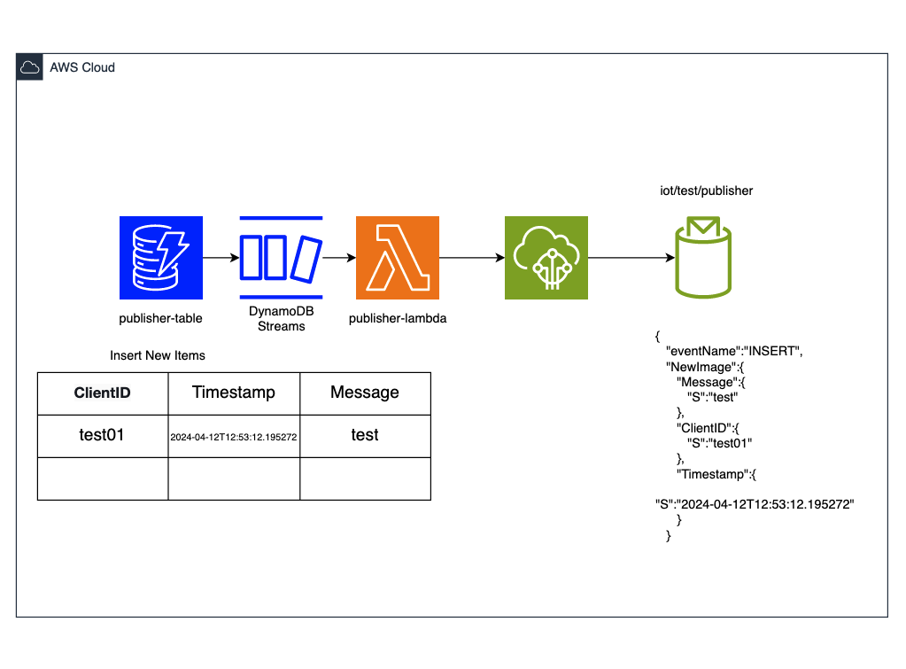

# Overview
- Set up AWS infrastructure resources for an IoT topic subscriber and publisher demo project.

# Architecture
## Subscriber:

1. Messages (from IoT devices, etc.) are sent in JSON format to the IoT topic (iot/test/subscriber).
1. The subscriber-lambda is triggered.
1. The subscriber-lambda extracts the message from the event and writes the data to the specified DynamoDB table (subscriber-table) in the specified format.

## Publisher:

1. The business application or similar creates (or updates or deletes) items in the specified DynamoDB table (publisher-table).
1. DynamoDB Streams captures the change data and triggers the publisher-lambda.
1. The publisher-lambda extracts the captured change data from the event and publishes a message to the specified IoT topic (iot/test/publisher) in the specified format.

# Deploy
1. Copy the backend file to the root directory of the repository.
    ```
    cd iot-topic-subscriber-publisher-demo
    cp ./env/dev/backend.tf .
    ```
1. Enter the value of the S3 bucket actually used in the `backend.tf` file.
1. Run the command below.
    ```
    terraform init
    terraform apply -var-file=./env/dev/ap-northeast-1.tfvars
    ```
