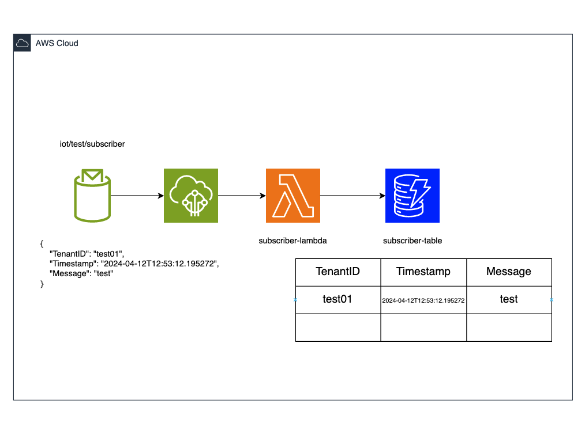

# Overview
- Set up AWS infrastructure resources for an IoT topic subscriber and publisher demo project.

# Architecture
## Subscriber:

## Publisher:


# Deploy
1. Copy the backend file to the root directory of the repository.
    ```
    cd iot-topic-subscriber-publisher-demo
    cp ./env/dev/backend.tf .
    ```
1. Enter the value of the S3 bucket actually used in the `backend.tf` file.
1. Run the command below.
    ```
    terraform init
    terraform apply -var-file=./env/dev/ap-northeast-1.tfvars
    ```
